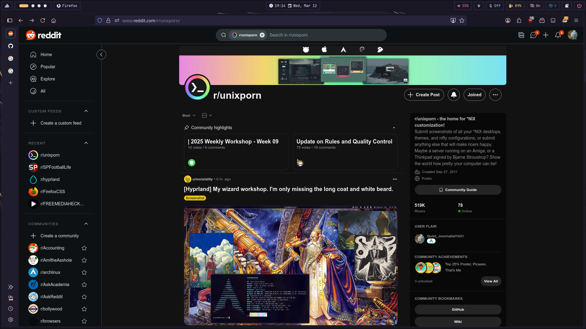
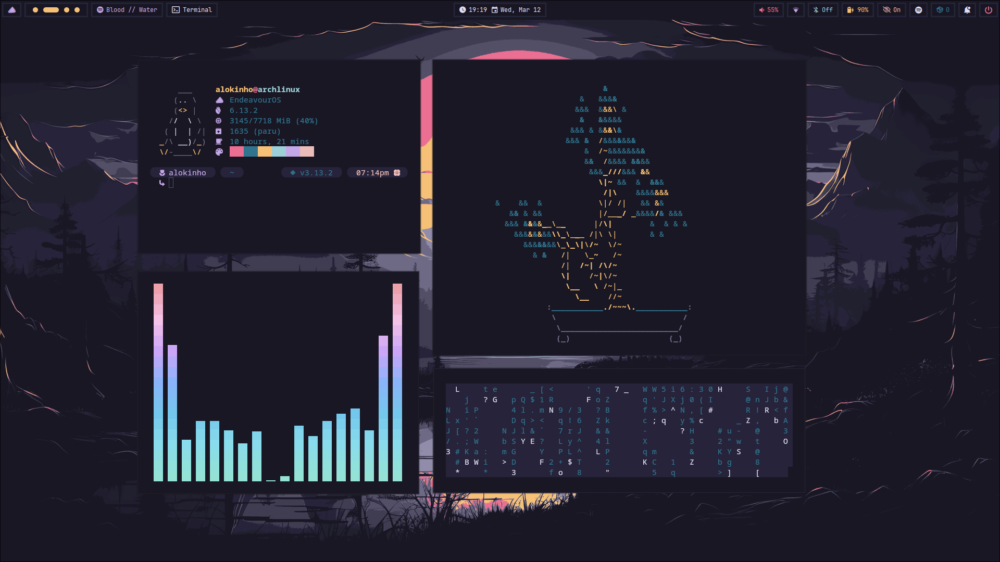
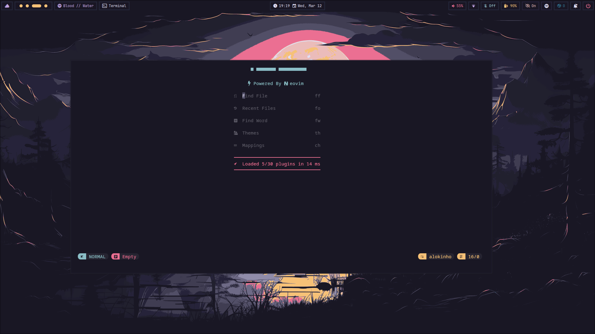
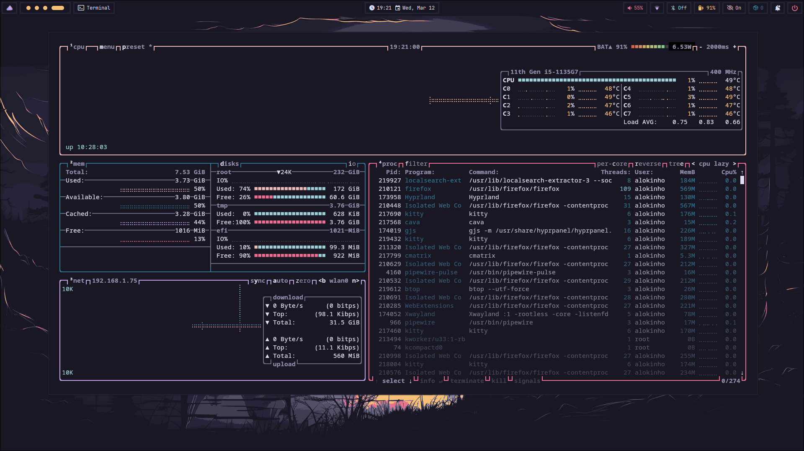
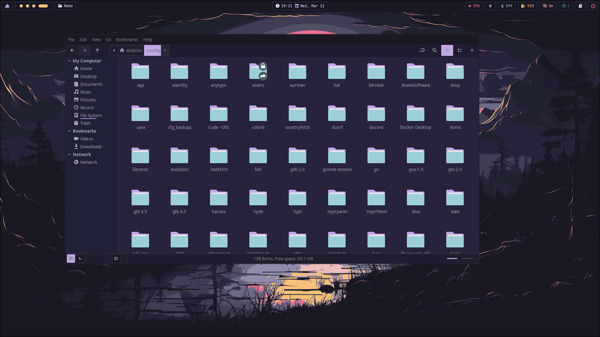

# hyprpine-dots
i have ocd i think

## Download These

- [hyprpanel](https://hyprpanel.com/)
- kitty
- nemo
- Kvantum
- cava
- btop
- nvim
- nwg-look
- rofi
- waypaper
- nerdfetch
- [starship](https://starship.rs/)
```
yay -S nvim waypaper nerdfetch hyprpanel
pacman -S kitty nemo kvantum cava btop nwg-look rofi
curl -sS https://starship.rs/install.sh | sh`
```
and paste these in your .bashrc or .zshrc
###  ~/.bashrc
`eval "$(starship init bash)"`
### ~/.zshrc
`eval "$(starship init zsh)"`


## Installation

```
git clone https://github.com/alokinho1/hyprpine-dots.git
cd hyprpine-dots
```
then, move the contents of `.config` to $HOME/.config
(exclude Assets folder & Wallpaper folder)

## Extra (Optional)

- Install hyprsunset (save your eyes)
   ```
   yay -S hyprsunset
   hyprsunset -t 5000

   # its probably enabled in startup at .config/hypr/hyprland.conf

- Enable network name:
Open Hyprpanel dashboard -> Settings -> Bar -> Network -> Enable Network Name

- Icons:
https://www.gnome-look.org/p/1810549

## Preview 








